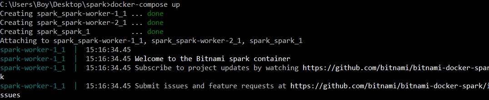
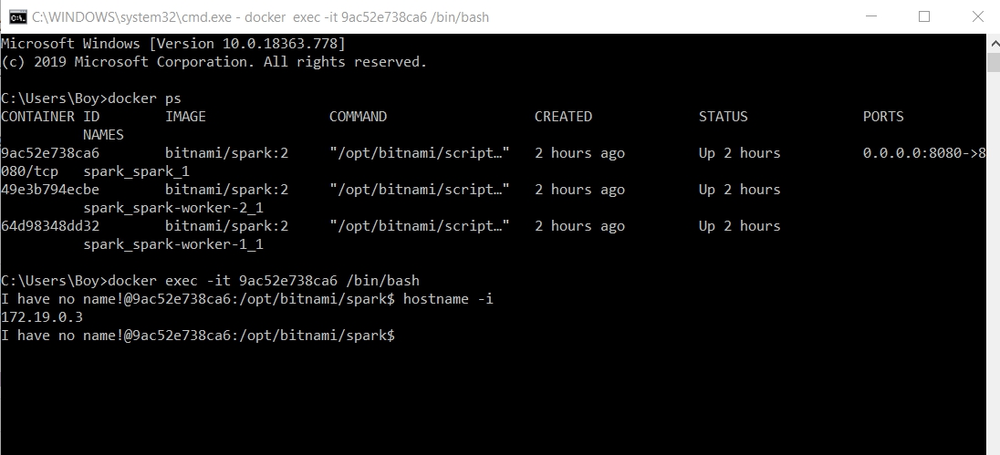
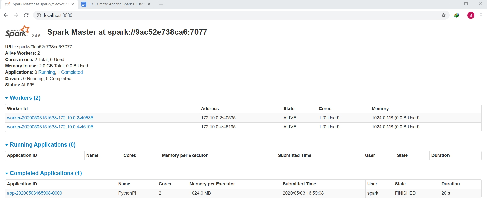
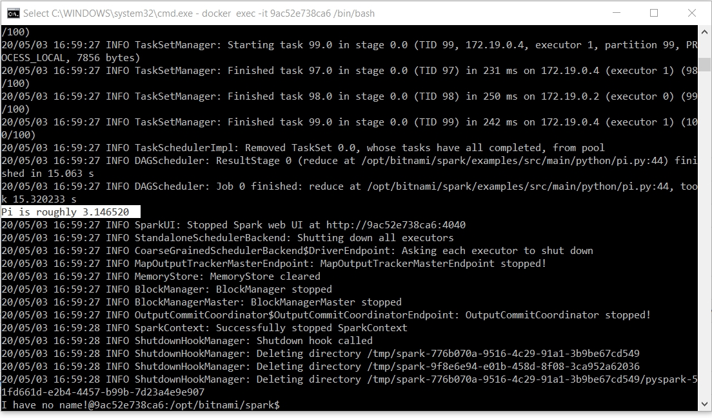
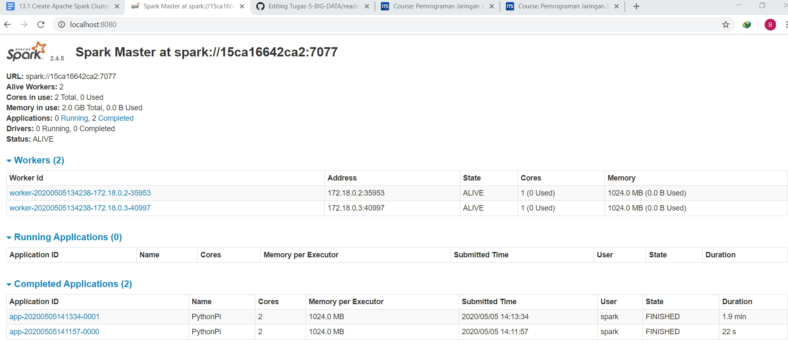
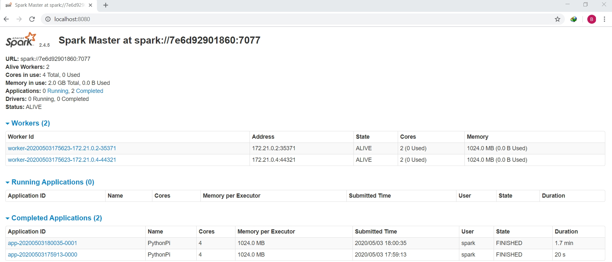
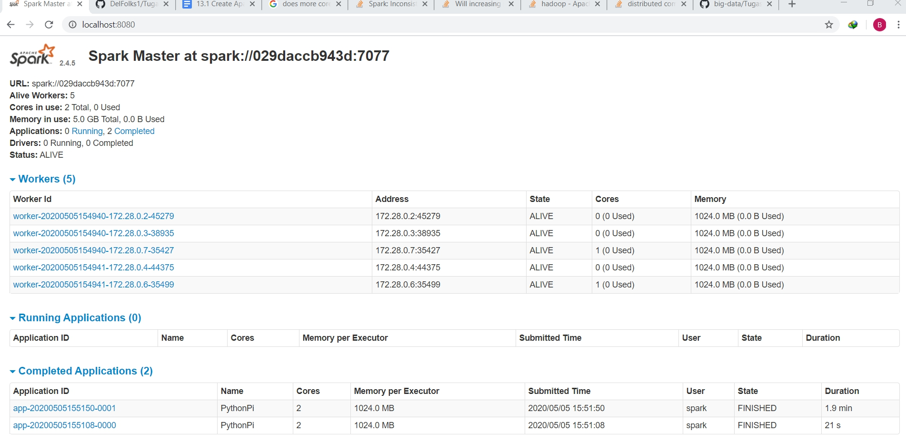
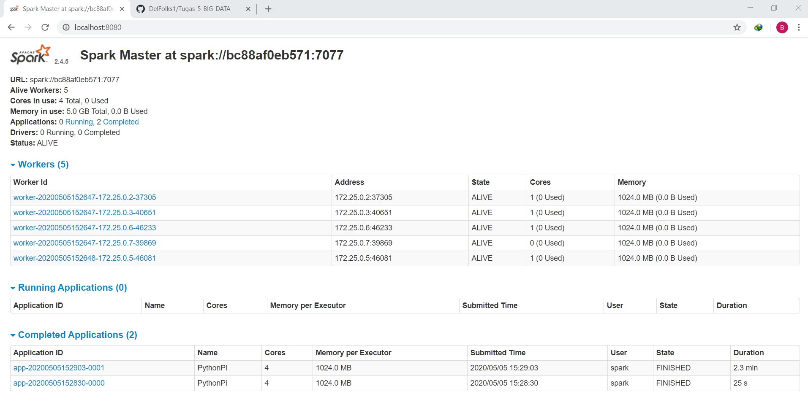

<h1> Membuat Apache Spark Cluster Menggunakan Docker </h1>
<h2> Membuat Apache Spark Cluster </h2>
1. Buat file docker-compose.yml yang berisi :  

  version: '2' 

  services: 
    spark: 
      image: bitnami/spark:2 
      environment: 
        - SPARK_MODE=master 
        - SPARK_RPC_AUTHENTICATION_ENABLED=no 
        - SPARK_RPC_ENCRYPTION_ENABLED=no 
        - SPARK_LOCAL_STORAGE_ENCRYPTION_ENABLED=no 
        - SPARK_SSL_ENABLED=no 
      ports: 
        - '8080:8080' 
    spark-worker-1: 
      image: bitnami/spark:2 
      environment: 
        - SPARK_MODE=worker 
        - SPARK_MASTER_URL=spark://spark:7077 
        - SPARK_WORKER_MEMORY=1G 
        - SPARK_WORKER_CORES=1 
        - SPARK_RPC_AUTHENTICATION_ENABLED=no 
        - SPARK_RPC_ENCRYPTION_ENABLED=no 
        - SPARK_LOCAL_STORAGE_ENCRYPTION_ENABLED=no 
        - SPARK_SSL_ENABLED=no 
        - SPARK_MASTER_URL=spark://spark:7077 
    spark-worker-2: 
      image: bitnami/spark:2 
      environment: 
        - SPARK_MODE=worker 
        - SPARK_WORKER_MEMORY=1G 
        - SPARK_WORKER_CORES=1 
        - SPARK_RPC_AUTHENTICATION_ENABLED=no 
        - SPARK_RPC_ENCRYPTION_ENABLED=no 
        - SPARK_LOCAL_STORAGE_ENCRYPTION_ENABLED=no 
        - SPARK_SSL_ENABLED=no 
    spark-worker-3: 
      image: bitnami/spark:2 
      environment: 
        - SPARK_MODE=worker 
        - SPARK_MASTER_URL=spark://spark:7077 
        - SPARK_WORKER_MEMORY=1G 
        - SPARK_WORKER_CORES=1 
        - SPARK_RPC_AUTHENTICATION_ENABLED=no 
        - SPARK_RPC_ENCRYPTION_ENABLED=no 
        - SPARK_LOCAL_STORAGE_ENCRYPTION_ENABLED=no 
        - SPARK_SSL_ENABLED=no 
    spark-worker-4: 
      image: bitnami/spark:2 
      environment: 
        - SPARK_MODE=worker 
        - SPARK_MASTER_URL=spark://spark:7077 
        - SPARK_WORKER_MEMORY=1G 
        - SPARK_WORKER_CORES=1 
        - SPARK_RPC_AUTHENTICATION_ENABLED=no 
        - SPARK_RPC_ENCRYPTION_ENABLED=no 
        - SPARK_LOCAL_STORAGE_ENCRYPTION_ENABLED=no 
        - SPARK_SSL_ENABLED=no 
    spark-worker-5: 
      image: bitnami/spark:2 
      environment: 
        - SPARK_MODE=worker 
        - SPARK_MASTER_URL=spark://spark:7077 
        - SPARK_WORKER_MEMORY=1G 
        - SPARK_WORKER_CORES=0 
        - SPARK_RPC_AUTHENTICATION_ENABLED=no 
        - SPARK_RPC_ENCRYPTION_ENABLED=no 
        - SPARK_LOCAL_STORAGE_ENCRYPTION_ENABLED=no 
        - SPARK_SSL_ENABLED=no 
         
2. Jalankan perintah docker-compose up 
 
3. Cek kontainer dengan docker-ps 
 
4. Kita dapat melakukan tes spark cluster dengan melakukan web UI   
 

<h2> Menjalankan Script Python di Dalam Apache Spark Cluster </h2>
1. Ketik docker ps untuk melihat container yang sedang berjalan 
2. Masuklah ke dalam container dan mengeksekusi bash dengan menggunakan perintah berikut: docker exec -it <container_id> /bin/bash. Container id diisi dengan id dari spark master 
3. Cek alamat IP dengan menggunakan perintah berikut : hostname -i  
 
4. Untuk melakukan submit job, Apache Spark menyediakan command spark-submit.  
Lakukan perintah berikut : spark-submit --master spark://172.18.0.4:7077 examples/src/main/python/pi.py 10  
5. Tunggu sampe proses selesai  
 

<h2> Tugas membandingkan </h2>
Lakukan percobaan dengan mengganti parameter-parameter berikut: 
Jumlah worker: 2, 5 
Jumlah CPU: 2, 4 
Memory: 1G 
Partisi: 100, 1000 

1. Lakukan cara2 diatas dari awal membuat spark cluster sampai dengan menjalankan pi.py di dalam CMD.  
2. Kita bandingkan 2 worker dengan 2 CPU antara 100 dan 1000 partisi  
  
3. Kita bandingkan 2 worker dengan 4 CPU antara 100 dan 1000 partisi  
  
4. Kita bandingkan 5 worker dengan 2 CPU antara 100 dan 1000 partisi  
  
5. Kita bandingkan 5 worker dengan 4 CPU antara 100 dan 1000 partisi  
  
Note : waktu proses selesai dari 1000 partisi selalu berada di bag atas (yang memiliki waktu lebih lama) sedangkan 100 partisi yg bagian bawah  

<h2> Kesimpulan </h2>
